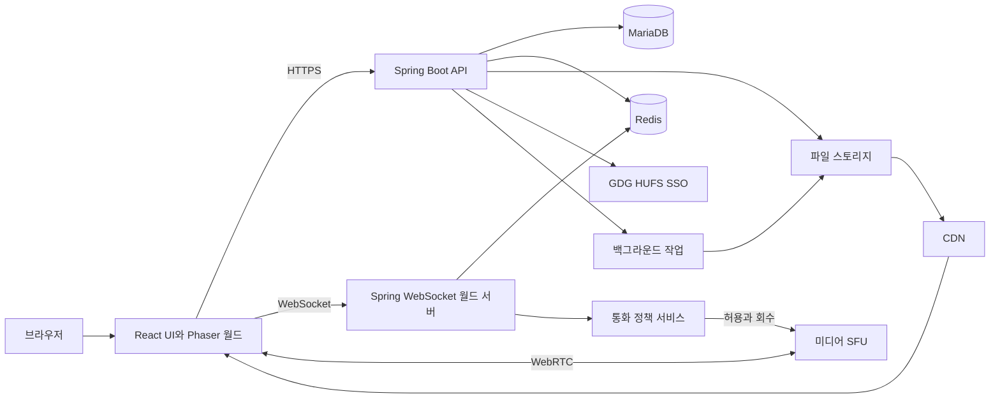
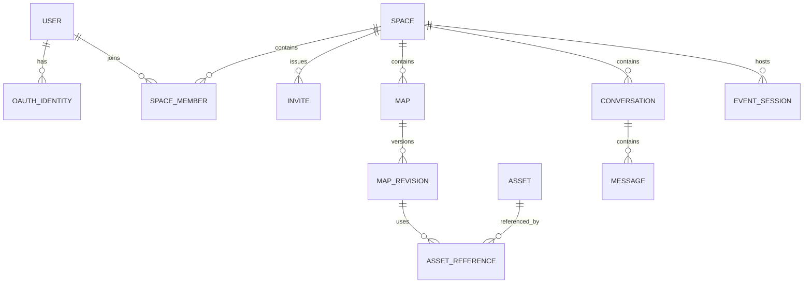

# 02. 시스템 구조·데이터·API 설계

## 1. 권장 구성과 책임

| 구성 | 기술안 | 책임과 선택 이유 |
|---|---|---|
| 웹 UI | React + Vite + TypeScript | 로그인 이후 화면·통화 패널·폼·에디터 UI. 대부분 앱 화면이므로 초기 SSR 불필요 |
| 2D 월드 | Phaser | 타일맵·스프라이트·카메라·입력·픽셀 렌더링 |
| API | Java + Spring Boot / Spring MVC / Spring Security | 인증·공간·초대·권한·맵 버전·운영 기능을 모듈로 분리 |
| 실시간 월드 | Spring WebSocket + Java 월드 모듈 | 맵별 상태 소유·입력 큐·tick·변경분 전송·재접속을 명시적으로 구현 |
| 미디어 | LiveKit Cloud 우선 검증; 대안 mediasoup + coturn | WebRTC SFU. G0에서 권한 강제·경계 전환·TURN·100명 경로 검증 후 하나만 채택 |
| 영속 데이터 | MariaDB(InnoDB) + Spring Data JPA + Flyway | 멤버십·역할·공간·지도 게시 버전·메시지·감사 기록. 마이그레이션은 Flyway로 관리 |
| 임시 공유 상태 | Redis | 정원 예약, 접속 존재, 일회성 티켓, 이벤트, 다중 월드 프로세스 연결 정보 |
| 파일 | S3 호환 오브젝트 스토리지 + CDN | 승인된 에셋·맵 스냅샷·썸네일. DB에는 키·해시·메타데이터 |
| UI 상태 | TanStack Query + 작은 Zustand stores | 서버 데이터 캐시와 순수 UI 상태 분리 |
| 계약 | OpenAPI + WebSocket/맵 JSON Schema + 생성 타입/공통 fixture | Java와 TypeScript의 필드·enum·좌표·버전 차이를 계약 검사로 방지 |
| 검사 | JUnit·Testcontainers(MariaDB/Redis), Vitest·Playwright, WS/실제 WebRTC 부하 도구 | 서버 정책·실제 DB 통합·브라우저·월드/미디어 부하를 각각 확인 |
| 관측 | 구조화 로그 + OpenTelemetry, 오류 수집 도구 | 가입/입장/미디어 실패 원인과 지연을 추적 |

프론트는 사용자가 지정한 React 기반 웹으로 확정한다. 백엔드는 Spring 선호를 반영해 Java/Spring Boot·MariaDB·Redis를 기본안으로 선택한다. 공간당 100명은 이 구성으로 검증할 목표이며, 스택 이름만으로 처리량을 보장하지 않는다.

T01/G0에서 지원되는 JDK LTS·Spring Boot BOM·MariaDB·Gradle·프론트 Node/SDK 조합을 확인해 고정한다. 초기 서버는 Spring MVC + JPA를 사용하고, 실시간 tick은 DB/네트워크 I/O와 분리한다. 단지 WebSocket을 쓴다는 이유로 WebFlux를 필수 도입하지 않는다. 초기 플랫폼은 Kubernetes 없이 컨테이너 배포 가능한 구성으로 시작한다.

Spring은 raw WebSocket과 STOMP를 지원한다. 이 제품은 이동·상태 패치·채팅에 버전 있는 자체 WebSocket 메시지를 사용한다. [Spring WebSocket 공식 문서](https://docs.spring.io/spring-framework/reference/web/websocket.html).

## 2. 전체 구조



API와 월드는 같은 Gradle 프로젝트의 모듈로 관리하고 배포 프로세스는 분리한다. Java 도메인 모듈을 공유하되, 실시간 상태의 소유자는 월드 프로세스다. MediaPolicy는 월드에서 호출하는 모듈이며 별도 마이크로서비스부터 만들지 않는다. 미디어 엔진 어댑터는 정책 결과를 실행하는 좁은 경계만 제공한다.

LiveKit 채택 시 JVM 서버 SDK 또는 공식 서버 API를 Spring에서 호출한다. SDK가 있다는 사실이 거리별 권한 요건 충족을 의미하지는 않으며 T05 검증은 유지한다. mediasoup를 선택하면 SFU 제어에 필요한 Node 프로세스를 별도로 두고 Spring이 승인한 명령만 전달한다. 브라우저 음성·영상은 SFU와 직접 WebRTC로 오가며 API·MariaDB·Redis를 경유하지 않는다. [LiveKit JVM 서버 SDK](https://github.com/livekit/server-sdk-kotlin).

React는 매 프레임 좌표를 state에 저장하지 않는다. Phaser와 월드 상태 어댑터가 렌더링을 맡고, React에는 선택 대상·대화 대상·인원 수·UI 이벤트만 전달한다. React 모달이나 채팅 입력에 포커스가 있으면 게임 입력을 멈춘다.

## 3. 제안 저장소 구조

현재 프론트/백엔드 폴더를 유지한다. 프론트는 pnpm, Java 백엔드는 Gradle Wrapper로 빌드한다. 공용 계약 원본에서 각 언어의 타입을 생성하고 fixture로 호환성을 검증한다. 실제 앱 골격 생성은 T01에서 수행한다.

```text
C:/Project/hufstown/
  프론트/
    package.json / pnpm-lock.yaml
    src/app/                 라우터·부트스트랩
    src/features/            auth, spaces, profile, chat, meeting, editor
    src/game/                scenes, rendering, input, world-adapter
    src/media/               장치 관리·MediaGateway client adapter
    src/components/          공용 UI
    src/generated/           계약에서 생성한 TypeScript 타입·API client
  백엔드/
    build.gradle.kts / settings.gradle.kts / gradlew / gradlew.bat
    apps/api/                Spring Boot REST·인증·관리 API
    apps/world/              Spring WebSocket·월드 tick·세션
    apps/worker/             Java 백그라운드 작업
    modules/domain/          Java 통화·권한·월드 정책
    modules/persistence/     JPA·repository·Flyway db/migration
    modules/protocol/        생성 DTO·메시지 검증·맵 해석
    contracts/               OpenAPI·WS/맵 JSON Schema·공통 fixture
    media-node/              mediasoup 선택 시 별도 Node 앱
    infra/                   로컬 compose·배포 설정
    docs/planning/           현재 문서
    docs/adr/                실제 채택한 결정과 근거
  디자인에셋/                 제공 원본; 런타임 전체 복사 금지
```

인증은 사용자 결정에 따라 GDG HUFS SSO 코드 교환과 Spring Security + Spring Session Redis로 처리한다. 회원·멤버십의 영속 원본은 MariaDB, 접속 중 월드 상태의 원본은 담당 월드 프로세스로 구분한다. 외부 교환 규격은 클론한 `hufs-code-master-server`에서 확인했다.

## 4. GDG HUFS SSO와 세션

1. 서버가 브라우저 세션에 연결된 일회용 `state`를 Redis에 10분 저장하고 authorize URL을 만든다.
2. IdP가 프론트 `/auth/callback`으로 보낸 `code/state`를 서버에 전달한다. 서버가 CSRF·state·코드 재사용을 검사한다.
3. 서버가 `POST /v1/sso/userinfo`에 `client_id/client_secret/code` JSON을 전송하고 `error_code` 및 `data.uuid/name/status`를 검증한다. OIDC가 아니므로 ID token/nonce/PKCE를 가정하지 않는다.
4. `gdg_hufs + uuid`를 외부 계정의 고유 키로 사용한다. 이메일로 계정을 합치지 않고 현재 불필요한 학번·이메일·소속은 저장하지 않는다.
5. Spring Session Redis의 불투명 ID와 `HUFS_TOWN_SESSION` HttpOnly/Secure/SameSite=Lax 쿠키를 사용한다. localStorage에 인증 토큰을 두지 않고 로그인 시 세션 ID와 CSRF 토큰을 회전한다.
6. API·프론트·월드를 동일 origin으로 제공한다. 상태 변경 API에 CSRF를 적용하고 WebSocket은 정확한 Origin과 로그인 세션을 검사한다. 현재 복귀 경로는 `/`로 고정하며 초대 복귀는 T07에서 추가한다.
7. 현재 비활성 만료는 8시간이다. 일반 로그아웃은 현재 브라우저 세션과 월드 탭을 종료하고, 탈퇴는 Redis 사용자 인덱스로 모든 브라우저 세션을 폐기한다. 계정 데이터 처리 조건과 남은 운영 검증은 [탈퇴 구현 기록](../implementation/16-account-deletion.md)을 따른다.
8. 참조 앱처럼 재학생·졸업생·강사·교수를 허용한다. 특정 공용 계정 UUID 예외는 복제하지 않는다. 직원·공용·미지원 상태의 정책 확대는 별도 결정한다.

구현 계약·설정·실제 검증 범위는 [SSO 연결 문서](../development/hufs-sso.md), 선택 근거는 [ADR 0002](../adr/0002-gdg-hufs-sso.md)를 따른다. 키 수령 전 모의 IdP로만 검증한다.

## 5. 입장과 접속 세션

`로그인 세션 → 공간 입장 판정 → 정원 임시 예약 → 월드 입장 티켓 → 실제 접속 확정 → 현재 통화 영역 티켓`을 구분한다.

- 입장 예약은 공간 전체 100명을 기준으로 Redis 원자적 연산으로 처리한다. 맵별 인원 합산의 시차로 100명을 초과하지 않게 한다.
- 예약 TTL 30초, 월드 티켓 30초·1회 사용을 초기값으로 한다. 월드 접속 성공 시 예약을 접속으로 전환한다.
- 월드 이동은 기존 공간 좌석을 유지하며, 동일 공간의 다른 맵에 새로 접속해도 두 좌석을 사용하지 않는다.
- 기본은 사용자당 공간 내 활성 탭 1개. 새 탭에서 접속을 넘겨받으면 이전 세션의 월드·미디어를 해제한다. 게스트는 별도 임시 ID를 사용한다.
- 접속에는 `sessionId`, `connectionEpoch`, `membershipVersion`을 붙여 오래된 연결과 취소된 권한을 구별한다.
- 차단·퇴장·멤버십 제거는 DB 기록과 이벤트 발행을 연결하고 월드 및 SFU 양쪽에서 회수한다. 이벤트 누락에 대비해 짧은 lease 갱신으로 재검증한다.
- 비공개 공간에는 인증 전 지도 파일·참가자 목록·채팅 이력을 제공하지 않는다. 공유 에셋 CDN과 비공개 맵 파일의 접근 정책은 다르다.

## 6. 데이터 모델

| 엔터티 | 핵심 필드/관계 |
|---|---|
| User | id, displayName, avatarConfigVersion, status, deletedAt |
| OAuthIdentity | provider, subject, userId, verifiedEmail; provider+subject unique |
| AuthSession | userId, tokenHash, expiresAt, revokedAt, lastSeenAt |
| AvatarPreset | userId, body/hair/clothes/headgear/accessory IDs, palette IDs |
| Space | ownerId, slug, title, visibility, joinPolicy, guestPolicy, capacity, status |
| SpaceMember | spaceId, userId, role/capabilities, state, version; 복합 unique |
| Invite | spaceId, tokenHash, codeHash, expiresAt, maxUses, uses, boundEmail, revokedAt |
| InviteRedemption | inviteId, userId, redeemedAt; 재시도 중복 방지 |
| Map | spaceId, title, order, publishedRevisionId, spawnId |
| MapRevision | mapId, revision, schemaVersion, objectKey, contentHash, authorId, state |
| MapDraft | mapId, baseRevision, draftVersion, documentKey, updatedBy |
| EditorLease | mapId, holderSessionId, expiresAt, fencingToken |
| Asset | owner/spaceId, type, objectKey, dimensions, hash, moderationState, sourceLicense |
| AssetReference | revisionId, assetId; 게시본에 쓰이는 파일 삭제 보호 |
| Zone | 맵 스냅샷 안의 stable id, type, polygon/tiles, capacity, mediaPolicy |
| Portal | 스냅샷의 id, targetMapId, targetSpawnId, accessPolicy |
| Conversation | type(global/zone/dm), spaceId, membership/zoneSessionVersion |
| Message | conversationId, senderId, clientMessageId, body, createdAt, deletedAt |
| EventSession | spaceId, schedule, stageMapId, presenterIds, state |
| Report / ModerationAction | actor, target, space, reason, duration, status |
| UserBlock | blockerId, blockedId, createdAt; 방향 있는 차단 |
| AuditLog / OutboxEvent | actor, action, resource, outcome, correlationId, deliveredAt |

Zone·Portal·오브젝트는 **불변 MapRevision 스냅샷이 원본**이다. DB에 검색용 인덱스를 둘 경우 동일 revision과 함께 생성하며, 두 저장소를 독립 수정하지 않는다. 개별 오브젝트 실시간 위치를 매 틱 DB에 저장하지 않는다.

MariaDB에는 관계 데이터·검색할 필드·파일 키·revision/hash를 저장하고 큰 맵 본문은 오브젝트 스토리지에 둔다. `JSON`은 `LONGTEXT` 기반이므로 JSON 내부 쿼리에 의존하는 구조를 기본으로 두지 않는다. 검색·정렬에 필요한 속성은 일반 열과 인덱스로 관리한다. [MariaDB JSON 문서](https://mariadb.com/docs/server/reference/data-types/string-data-types/json).

문자열은 utf8mb4로 관리하고, 식별자/초대 해시의 비교 규칙을 명시한다. 시간은 UTC 기준으로 저장한다. draft와 멤버십의 version 조건부 갱신·소유권 이전·메시지 저장/outbox 기록을 트랜잭션으로 처리한다. 개발/검증도 실제 MariaDB 컨테이너를 사용해 H2 등 다른 DB와의 동작 차이를 줄인다. 운영 스키마 자동 수정 대신 Flyway 마이그레이션을 적용한다.



외래키와 공간 범위 검사를 함께 적용한다. 다른 공간의 mapId·assetId·messageId를 아는 것만으로 접근할 수 없다. 소유권 이전은 수신자 수락과 트랜잭션으로 처리해 소유자 없는 공간이 생기지 않게 한다.

## 7. API 계약 초안

버전 prefix `/api/v1`, 공통 오류 `{code, message, requestId, details?}`. mutation 재시도는 `Idempotency-Key` 또는 `clientMessageId`를 사용한다. 목록은 커서 페이지네이션으로 제한한다.

| 메서드/경로 | 책임 |
|---|---|
| GET /auth/google, /auth/google/callback | 로그인 시작/완료 |
| POST /auth/logout; GET /me; PATCH /me | 세션·프로필 |
| GET /avatar/catalog; PUT /me/avatar | 유효한 파츠 목록·조합 저장 |
| GET/POST /spaces; GET/PATCH /spaces/:id | 검색·생성·설정 |
| POST /spaces/:id/invites; DELETE /invites/:id | 초대 생성/회수 |
| POST /invite-redemptions | 코드/링크 교환, 멤버십 처리 |
| POST /spaces/:id/join-reservations | 정책 확인·좌석 예약·월드 티켓 |
| PATCH /spaces/:id/members/:userId | 역할·멤버십 수정 |
| GET /spaces/:id/maps; POST /spaces/:id/maps | 맵 목록/생성 |
| GET /maps/:id/revisions/:revision | 접근 가능한 맵 스냅샷 |
| POST /maps/:id/editor-leases | 편집 lease 확보 |
| PATCH /maps/:id/draft | expectedVersion과 operation batch로 저장 |
| POST /maps/:id/validate; POST /maps/:id/publish | 게시 전 검증/게시 |
| POST /maps/:id/rollback | 이전 내용을 새 게시 revision으로 복원 |
| POST /assets/upload-intents; POST /assets/:id/complete | 제한된 업로드와 처리 요청 |
| GET /conversations/:id/messages | 현재 권한으로 허용된 이력만 조회 |
| POST /reports; POST /spaces/:id/moderation-actions | 신고·운영 조치 |
| POST /spaces/:id/events | 행사 생성·진행 상태 |

미디어 티켓 발급은 임의 roomName 요청을 받지 않고 월드가 승인한 session/domain/epoch를 확인한다. 미디어 구현에 따라 API 또는 인증된 WS 요청을 쓰되 의미는 동일하게 유지한다.

## 8. 이벤트 계약 초안

| 방향 | 이벤트 | 필드와 규칙 |
|---|---|---|
| C→S | movement.input | seq, direction, running; 좌표를 권위 값으로 받지 않음 |
| S→C | world.snapshot/patch | serverTick, mapRevision, entity state, lastProcessedSeq |
| C→S | object.interact | objectId; 거리·권한·게시 버전 확인 |
| C→S | social.emote / social.poke | 종류·대상, 속도 제한 |
| C→S | chat.send | conversationId, clientMessageId, text; 서버에서 수신 범위 판정 |
| S→C | chat.message | serverMessageId, authorized audience context |
| S→C | media.policy | policyEpoch, allowed peer/source set, domainId; 서버 policy의 UI용 투영 |
| C→S | meeting.knock / meeting.respond | 요청과 호스트 응답, 만료 포함 |
| S→C | map.revision.pending/applied | 새 버전·전환 시점·필요 시 안전 스폰 |
| S→C | session.revoked / connection.state | 이유 코드·재입장 가능 여부 |

미디어 실제 트랙은 WS 메시지로 전송하지 않는다. 채팅 영속 전송 성공은 DB 쓰기 이후 ACK하며, 이모지·위치 같은 휘발 이벤트와 구분한다. 이벤트 payload에 이메일·초대 비밀값을 실어 전체 방에 방송하지 않는다.

이동 WS는 먼저 명확한 버전의 JSON 메시지로 검증하고, 인코딩 비용이 목표를 초과하면 같은 의미의 바이너리 포맷을 도입한다. 처음 접속에는 snapshot, 이후에는 baseRevision/serverTick과 변경분을 전달한다. 누락·버전 불일치·재접속 때 snapshot으로 다시 맞춘다. Java 정책과 TypeScript 예측에 동일 fixture를 적용한다.

Redis는 좌석 예약·접속 요약·일회성 티켓·캐시·노드 소유 정보에 사용한다. 고빈도 위치 원본을 매 tick Redis에 쓰거나 Pub/Sub로 전체 방송하지 않는다. Pub/Sub는 전달 누락이 가능한 알림이므로, 권한 취소·맵 게시의 원본은 MariaDB outbox에 남기고 eventId/대상 노드별 적용 ACK·재시도·주기적 상태 재확인으로 복구한다. 여러 대상에 필요한 이벤트를 단일 소비자 그룹 하나로 보내 일부 노드만 받게 만들지 않는다. [Redis Pub/Sub 전달 의미](https://redis.io/docs/latest/develop/pubsub/).

## 9. 배포·확장·실패 처리

- 개발: Windows에서 React/Node와 Java/Gradle 실행, MariaDB/Redis는 Docker 환경. 자체 SFU를 선택하면 Linux 컨테이너/WSL2 또는 Linux 개발 서버에서 운영 조건을 검증한다.
- 운영: 정적 프론트/CDN, 항상 켜진 API·월드 컨테이너, 관리형 DB/Redis/스토리지. 장시간 WS를 처리할 수 없는 단기 서버리스 함수에 월드 서버를 올리지 않는다.
- API는 서버 저장 세션을 공유하면서 확장한다. 월드는 맵 인스턴스마다 소유 프로세스와 직렬 입력 큐를 두고, 입장 시 해당 프로세스로 라우팅한다. 소유권 lease/fencing epoch를 확인하고 소유권을 잃으면 해당 월드 처리를 중단한다. Redis만 추가해서 동일 맵을 여러 프로세스가 동시에 수정하도록 구성하지 않는다.
- 초기 한 공간은 하나의 월드 프로세스 안 여러 맵으로도 운영할 수 있다. 첫 출시 전에 전환 시 좌석·세션·미디어 회수를 확인한다. 실제 샤딩은 측정 후 적용한다.
- 맵이 바뀌어도 동일 공간 좌석은 유지한다. 다른 공간 이동은 대상 예약 성공 후 이전 공간 좌석을 반환하는 전환 프로토콜로 처리한다.
- 월드 장애 시 기본 30초 재접속 유예, 이후 안전 스폰 복귀. DB의 맵/멤버십/채팅은 유지하되 마지막 수초 좌표 복구는 보장하지 않는다.
- 미디어 장애 시 지도·채팅은 계속 동작하고 통화 실패를 명시한다. 월드 권한 연결이 끊기면 미디어는 lease 만료 후 중지한다.
- DB 장애 시 신규 로그인·입장·게시를 제한한다. 기존 지도 세션은 한정 시간 유지할 수 있으나 새 권한 부여는 실패로 처리한다.
- 무중단 월드 이전을 가정하지 않는다. 신규 입장을 새 프로세스로 보내고 기존 방을 비운 뒤 종료하는 drain 배포를 기본으로 한다.

## 10. 운영과 데이터 취급

DB 일일 백업 + 시점 복구, 게시 맵 불변 보관, 오브젝트 버전 관리, 실제 복원 훈련을 포함한다. 출시 목표는 핵심 영속 데이터 RPO 15분 이내·RTO 2시간 이내이며 선택한 운영 상품에서 가능한지 별도 검증한다.

초기 보존 제안: 근거리 채팅은 비영속, 회의실 채팅은 기본 회의 세션 범위/24시간, 전체·DM 30일, 운영 감사 90일. 운영 목적과 이용약관을 확정하면서 변경한다. 과거 회의실 이력은 뒤늦게 입장한 사용자에게 자동 노출하지 않는다. 녹화는 기본 꺼짐이다.

자산 업로드는 격리 저장 → 실제 MIME/해상도/용량 검증 → 이미지 재인코딩 → 승인 상태 → CDN 배포 순서다. SVG는 검증된 번들 브랜드 에셋만 초기 허용한다. 외부 링크·임베드는 허용 정책과 sandbox를 적용하고 서버가 임의 URL 내용을 가져오는 기능은 초기 제외한다.

오류 로그에 OAuth code·token·초대 원문·사적 메시지 본문·음성·영상 내용을 남기지 않는다. 비공개 통화는 다른 참가자에게 전달하지 않는다는 의미이며, E2EE까지 구현·검증하기 전 종단간 암호화라고 표시하지 않는다.
