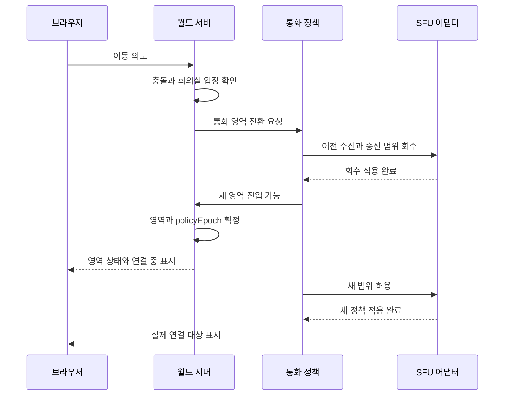

# 03. 실시간 이동·근거리 대화·미디어 설계

## 1. 절대 유지할 조건

1. 현재 위치·입장 권한·구역 소속은 월드 서버가 확정한다.
2. 미디어 수신 허용 여부는 `(송신자, 수신자, 트랙 종류, 통화 영역, 정책 버전)`으로 판정한다.
3. 수신 불허는 SFU가 트랙 전달을 중단하는 것으로 구현한다. 영상 숨김·볼륨 0·클라이언트 자동 구독 해제만으로 완료하지 않는다.
4. 독립 회의실 전환은 기존 대화 회수 후 새 대화 허용 순서다. 잠깐의 무음이 양쪽 대화 중첩보다 우선한다.
5. 채팅·화면공유 오디오에도 동일한 경계를 적용한다. 마이크만 분리하고 화면 음성이 새는 구조는 허용하지 않는다.
6. “현재 연결된 사람” 목록은 실제 적용된 통화 정책을 기준으로 표시한다.

이 문서의 속도·반경·인원·지연 값은 초기 튜닝값/출시 목표다. 구현 또는 성능 검증 결과가 아니다.

## 2. 월드 동기화

기본 구현은 **Spring WebSocket + Java 월드 모듈**이다. Spring이 메시지 연결을 제공하고, 상태 복제·tick·관심 영역·재접속 프로토콜은 이 제품에서 구현한다. 전문 게임 서버 라이브러리가 제공하는 동기화 기능을 자동으로 얻는 구성은 아니므로 T03·T10의 산출물로 명시한다.

각 맵의 입력을 큐에 넣고 한 시점에 한 실행 흐름만 상태를 변경한다. 모든 맵을 전역 단일 스레드에 묶거나 맵마다 전용 OS 스레드를 무제한 생성하지 않고, 한정된 실행기에서 맵별 직렬 처리를 보장한다. DB 조회·Redis 호출·SFU API·이미지 작업은 tick 밖에서 수행하고, 결과를 epoch를 확인하는 명령으로 다시 넣는다.

세션별 송신도 직렬화하고 전송 큐·버퍼·시간 상한을 둔다. 느린 클라이언트는 오래된 위치 업데이트를 병합/폐기한 뒤 새 snapshot으로 복구하며, 채팅/권한 이벤트는 그 정책으로 버리지 않는다. tick에서 동기 send를 기다리지 않는다. [Spring WebSocket 송신 동시성](https://docs.spring.io/spring-framework/reference/web/websocket/server.html).

| 항목 | 제안 |
|---|---|
| 서버 시뮬레이션 | 20Hz, 50ms tick |
| 클라이언트 입력 | 방향 변화 즉시 + 최대 20Hz, sequence number 포함 |
| 상태 패치 | 10~20Hz에서 측정 후 결정 |
| 화면 렌더링 | 기기 기준 60fps 목표, 저사양 30fps 모드 |
| 이동 속도 | 걷기 3 tile/s, 달리기 5 tile/s |
| 보간 | 원격 아바타 100ms 전후 버퍼, RTT·지터로 조정 |
| 복구 | 로컬 예측 + 서버 결과 보정, 입력 ACK |
| 위치 관심 영역 | 카메라 주변 + 여유 영역, 참가자 목록용 요약 별도 |
| 발화/표정 | 위치보다 낮은 갱신 빈도, 변화 때 전송 |

입력은 이동 의도다. 서버는 delta time 상한·속도·충돌·잠긴 문·포털 접근을 검사한다. 대각선 이동은 정규화한다. 블록 충돌은 달리기 중에도 수행하고, 사람끼리의 충돌은 기본 비활성으로 하여 출입문을 막는 현상을 줄인다. 탭 전환·포커스 상실 때 이동 입력을 해제한다.

지도는 논리 타일 좌표와 연속 위치를 구분한다. 전송 좌표는 예를 들어 1/256타일 단위로 양자화하고, 충돌 계산 기준 좌표계를 모든 앱에서 공유한다. 픽셀 확대율을 바꾸어도 이동 속도나 반경이 달라지지 않는다.

100명 전체 쌍은 4,950개다. 초기 구현은 correctness 우선으로 가능한 크기이지만, 반경 검색은 8×8타일 등의 spatial hash 버킷으로 줄이고 매 틱 전체 미디어 API 호출을 하지 않는다. AOI 최적화 전후 CPU·직렬화 비용을 측정한다.

## 3. 근거리 판정

초기값은 연결 시작 5타일, 기존 연결 종료 7타일이다. 연결 상태가 경계에서 반복 토글되는 것을 막기 위해 진입은 약 200ms 안정 상태를 확인한다. 거리 이탈은 7타일을 넘는 다음 정책 평가에서 해제한다. **비공개 경계·차단·강퇴에는 거리 유예를 적용하지 않는다.**

일반 공개 구역에서는 같은 맵·음향 구획의 사람만 후보로 잡는다. 장식 벽은 자동 방음벽으로 취급하지 않고 편집자가 `acousticRegion` 또는 독립 구역을 지정한다. 사용자에게 방음되는 벽과 단순 장식의 차이가 보이게 한다.

근거리 연결은 그래프의 연결 요소 전체가 아니라 사용자 쌍별 edge다. A와 B, B와 C가 가까워도 A와 C가 멀면 A-C 미디어 전달은 없다.

```text
allowed(sender, receiver, source, context):
  둘의 공간 세션과 lease가 유효하지 않으면 false
  서로 다른 공간 또는 취소된 권한이면 false
  차단 관계/운영 제한/송신 동의/source별 제한에 걸리면 false
  어느 한쪽이 독립 구역이면:
    같은 독립 구역 + 양쪽 입장 승인 + source 허용 여부 반환
  어느 한쪽이 무음 구역이면 false
  승인된 행사 송신과 행사 수신 관계이면 행사 정책 반환
  같은 일반 맵·음향 구획이 아니면 false
  거리 edge 상태와 source 공유 범위에 따라 반환
```

`allowed`는 접근 자격이고 `selected`는 현재 실제 수신 품질/개수 정책이다. 전체 모임에서 자격이 있는 사람을 영상 타일에서 잠시 내리는 것과 비공개 사용자 접근을 막는 것은 다른 동작이다.

거리별 음량은 허용된 트랙에서만 적용한다. 예시: 2타일 이내 100%, 2~7타일 완만한 감쇠, 7타일 이상 0 및 구독 해제. 좌우 공간 음향은 선택 기능이며 헤드폰과 브라우저 조건에서 검증한다.

밀집 구역에서 기본 한 사람의 근거리 대화 후보는 최대 12명이다. 기존 대화 유지·거리·사용자 선택을 고려해 서버가 양방향 관계를 함께 고른다. 제한에 도달했으면 UI에 표시하고 더 큰 모임은 회의실/전체 모임으로 유도한다. 조용히 임의 사람을 탈락시키지 않는다.

## 4. 통화 영역과 범위

### 정책 계약과 판정 우선순위

정책 입력은 월드 서버가 위치·권한을 확인한 참가자 `Person` 목록이다. 각 참가자는 `Domain(spaceId, mapId, mapRevision, zoneId, scope, eventId)`, 연속 타일 좌표, `policyEpoch`, 장치 사용 상태, 양방향 차단 목록, 운영자 제한, source별 제한, 행사 발언자 자격을 가진다. `scope`는 `NEARBY`, `PRIVATE_ROOM`, `SILENT`, `EVENT` 중 하나다. `MICROPHONE`, `CAMERA`, `SCREEN`, `SCREEN_AUDIO`는 독립 source다.

`Decision`은 참가자별로 허용된 상대 ID 집합과 연결 상한 때문에 제한된 참가자 집합을 반환한다. 상대 관계는 A→B만 성립할 수 없도록 대칭으로 고른다. 이웃의 연결 요소를 따라 전파하지 않는다. 참가자 `policyEpoch`는 월드 접속 epoch와 구별하며, 통화 영역·맵·권한·제한이 바뀔 때 증가한다. `MediaState.policyEpoch`와 `MediaRequest.policyEpoch`가 이 값을 전달해 이전 영역에서 시작한 비동기 요청을 거절한다.

미디어 domain key 규칙:

- 근거리: `spaceId + mapId + mapRevision + common`; 일반 공개 구역은 같은 공개 맵에서 근거리 판정을 공유한다.
- 독립 회의실: `spaceId + mapId + mapRevision + zoneId`; 같은 회의실 안에서는 거리와 관계없이 정책 대상이며 입장은 월드의 회의실 승인/정원 판정을 먼저 통과해야 한다.
- 무음 구역: 참가자의 source를 모두 거절한다.
- 행사: `spaceId + eventId`; 같은 공간의 공개 맵 사이에서 발표자와 행사 청중을 연결한다. 독립 회의실은 행사 domain에 포함하지 않는다.

수신/송신 판정은 다음 순서를 유지한다. 연결·공간 권한·지도 세션이 유효한지 확인하고, 전환 상태와 접속/가용 상태를 확인한다. 이어 양쪽 차단·운영 조치·source별 제한을 확인한다. 무음 구역은 다른 조건보다 우선해 전면 거절한다. 회의실은 승인된 동일 회의실만 허용하고, 행사는 같은 eventId 안에서 발표자와 청중 관계를 허용한다. 그 외에는 같은 근거리 domain과 거리 edge를 적용한다. 마지막으로 sourceAllowed를 각 발신 source에 적용하고, 대화 상대/행사 청중 상한을 대칭으로 선택한다. 비공개·무음·차단 회수는 거리 hysteresis를 적용하지 않는다.

회의실과 행사 domain은 `MediaPolicy.Domain` 입력에 구조화해 두며 SFU에 전달할 때만 제한된 문자를 사용하는 key로 직렬화한다. client가 전송한 domain이나 수신자 목록은 판정의 근거로 사용하지 않는다.

| 모드 | 송신 자격 | 수신 범위 | 기본 제한 |
|---|---|---|---|
| 근거리 | 본인이 장치를 켠 참가자 | 허용된 가까운 사용자 쌍 | 대화 대상 12, 보이는 영상 8 |
| 독립 회의실 | 해당 회의실 승인 참가자 | 같은 회의실 | 일반 12명, 거리 무시 |
| 대형 회의실 | 해당 회의실 참가자 | 같은 회의실, 발언 우선 | 25명, 영상은 선택 수신 |
| 전체 모임 | 전체 모임에 참여하고 송출을 켠 사람 | 공간의 행사 참여자 | 100명, 활성 음성/영상 제한 |
| 발표 | 운영자가 지정한 발표자 | 행사 청중 | 발표자 1~4명, 청중 100명 |
| 무음/집중 | 송신 중지 | 통화 미수신 | 채팅·지도 사용 가능 |

전체 모임은 100명 모두 마이크·카메라 송출을 허용할 수 있다. 단, 동시 활성 음성은 기본 8명·영상은 8~12명까지 선정한다. 참가자 목록에는 100명이 모두 보이고 개인 고정·페이지 이동으로 다른 영상을 볼 수 있다. 발표 모드에선 청중 송출 권한을 기본 끄고 손들기 승인 후 부여한다.

발표 범위를 `space event`로 선택하면 같은 공간의 다른 일반 맵에서도 수신할 수 있다. 독립 회의실 사용자는 기본 제외한다. 무대 타일에 서는 것만으로 전체 송출 권한이 생기지 않는다. 전원 공지 텍스트는 별도 기능이다.

화면공유는 시작 시 `주변 / 이 회의실 / 행사 전체`를 표시한다. 행사 전체는 발표 권한이 있어야 한다. 통화 영역 변경·차단·퇴장·탭 종료 시 공유 트랙을 중단한다. 이전 회의 화면을 새 대화 대상에게 자동 재송출하지 않는다.

## 5. 미디어 엔진 결정 게이트

### 후보 A: LiveKit Cloud

장점은 브라우저 SDK·기기 처리·SFU·TURN·운영 도구를 조합하기 쉽다는 것이다. 그러나 일반적 회의 서비스의 선택 구독과 이 제품의 서버 기준 거리별 접근 통제는 다르다.

공식 자료는 `autoSubscribe`와 선택 구독, RoomService의 구독 관리, 게시자 단위 트랙 권한을 각각 설명한다. **이 기능들이 결합되면 서버 전용 수신 허용 목록이 자동으로 생긴다고 가정하지 않는다.** `canSubscribe=false`와 서버 `UpdateSubscriptions` 조합에도 공개 이슈 보고가 있으므로 실제 고정 버전에서 확인해야 한다. 이는 특정 버전의 보고이며 모든 배포에서 동일하게 실패한다는 단정은 아니다.

후보 A를 채택하려면 G0에서 다음을 모두 증명한다.

- 정책상 허용된 참가자는 음성/카메라/화면/화면 오디오를 받는다.
- 허용되지 않은 참가자에게는 SFU 전달이 생성되지 않는다. 클라이언트 UI 설정에 의존하지 않는다.
- 새 트랙 게시·연결 복구·역할 변경 중에도 기본 허용 구간이 발생하지 않는다.
- 정책 회수 이후 기존 수신도 종료한다. 발급했던 연결 티켓으로 옛 권한이 복구되지 않는다.
- 독립 회의실은 별도 미디어 room으로 분리하거나 동등하게 검증된 서버 정책을 갖춘다.
- 게시자 클라이언트가 권한 업데이트를 적용해 준다는 가정만 필요한 방식이면 **서버 강제 요건 미충족으로 기록**하고 채택하지 않는다.

통과하면 구체적 API·권한·버전·재접속 동작을 ADR에 기록한다. 필수 조건에 실패하면 실패 원인을 기록하고 후보 B를 검증한다. 기획 단계에서 이 검증이 끝났다고 표시하지 않는다.

참고: [트랙 구독](https://docs.livekit.io/transport/media/subscribe/), [RoomService](https://docs.livekit.io/reference/other/roomservice-api/), [공식 저장소 이슈 4651](https://github.com/livekit/livekit/issues/4651).

### 후보 B: mediasoup + coturn

서버가 직접 Consumer 생성·중지·종료를 소유한다. 클라이언트의 구독 요청은 의도일 뿐이며 MediaPolicy 허용 결과가 있어야 Consumer를 만든다. SFU·WebRTC 구현은 mediasoup 라이브러리를 사용하고 직접 코덱/전송 엔진을 작성하지 않는다.

초기에는 맵 공개 영역과 독립 회의실에 Router를 할당하고, 행사 전체 전달은 허용된 발표 Producer만 필요한 Router에 pipe한다. 실제 Router/Worker 배치는 부하 측정으로 결정한다. 회의실 이동 시 이전 Producer/Consumer를 정리하고 새 영역에 게시한다. 전체 공간 무대 연동의 파이프는 서버 정책만 생성한다.

장점은 수신 권한과 전달 수명을 직접 통제할 수 있다는 것이다. 이 경로를 선택하면 AI가 장치·재연결·시그널링·TURN·품질 조절·리전 운영을 구현하는 세부 태스크를 수행한다. 선택한 엔진의 산출물과 검증 범위를 T05·T12·T13·T26에 반영한다.

권한 확인 후 서버 Consumer를 일시 중지 상태로 생성하고 브라우저 준비 완료 후 재검증·재개한다. 코덱 호환성 확인은 접근 권한 확인을 대신하지 않는다. [mediasoup 공식 통신 흐름](https://mediasoup.org/documentation/v3/communication-between-client-and-server/).

### 어댑터가 제공할 의미

`joinDomain`, `authorizePublication`, `setAllowedReceivers`, `revokeSession`, `switchDomain`, `getAppliedPolicyEpoch`, `getConnectionStats` 정도로 좁힌다. 임의 기능을 모두 추상화하는 범용 RTC 프레임워크는 만들지 않는다. 구현되지 않은 접근 통제를 어댑터 이름만으로 지원한 것처럼 처리하지 않는다.

## 6. 구역 전환 프로토콜



- 회수 완료 전에는 사용자에게 새 비공개 회의가 연결됐다고 표시하지 않는다. 기존 회의 참가자에게도 전환 상태를 동기화한다.
- 화면공유는 전환 시작 시 중지하며 재시작에 별도 조작이 필요하다.
- 입장 좌석은 전환 중 임시 예약한다. 동시에 마지막 회의실 좌석을 차지하지 않게 한다.
- 메시지와 API에 `sessionEpoch`, `policyEpoch`를 붙이고 오래된 비동기 결과를 버린다.
- 전환 중 실패하면 연결을 닫고 문 앞 또는 안전 스폰에 둔다. 두 영역 연결을 동시에 남기는 복구는 하지 않는다.
- 일반 거리 edge 변화는 차이만 적용한다. 사생활 경계는 상태 전환 장벽을 통과해야 한다.

이미 수신자 장치에 전달된 미디어를 회수할 수는 없다. 합격 기준은 서버의 회수 적용 완료 이후 새 미디어를 전달하지 않는 것이고, 네트워크/재생 버퍼 잔여 시간은 별도 측정·기록한다. UI만 보고 비누출로 판정하지 않는다.

## 7. 장치·공유·품질

- 첫 화면: 카메라 미리보기, 마이크 레벨, 출력 테스트, 권한 상태. 장치가 없어도 텍스트 참가 가능.
- 송신 기본값: 음성 Opus, 카메라 360p 기본/720p 선택, 화면 문서 공유 1080p 10~15fps 목표. 코덱은 브라우저 교집합과 실제 SDK 지원으로 확정한다.
- 카메라 simulcast/adaptive subscription을 사용해 썸네일과 확대 영상 품질을 나눈다. mediasoup 경로에서는 레이어 선택·발화자 선정 정책을 직접 구현해야 한다.
- 저대역폭: 카메라 해상도 축소 → 보이는 영상 수 축소 → 카메라 끄고 음성 유지 → 재연결 안내 순서.
- 화면공유 종료 이벤트, 카메라 제거, 헤드셋 변경, OS 권한 철회, 네트워크 전환을 상태 머신으로 처리한다.
- 사용자가 공유 대상을 고르는 브라우저 팝업을 자동 생략할 수 없다. 화면/탭 오디오와 모바일 송출 지원은 브라우저·OS마다 다르다. [MDN getDisplayMedia](https://developer.mozilla.org/en-US/docs/Web/API/MediaDevices/getDisplayMedia).
- 자동재생 차단 시 “소리 켜기” 동작을 제공한다. 출력 장치 선택 API가 없으면 OS 설정 안내로 대체한다.
- PTT는 채팅 입력·브라우저 단축키와 충돌하지 않게 설정 가능하게 한다. DND·개인 음소거·운영자 제한의 우선순위를 UI에서 구분한다.

## 8. 데이터량을 계산하는 방법

100명이 99개의 0.5Mbps 영상을 모두 받으면 수신 합계가 약 **4.95Gbps**, 사용자당 **49.5Mbps**다. 이 숫자에는 오디오·화면·전송 오버헤드가 없다. 따라서 “100명 접속”만 보고 영상 설계를 정하면 안 된다.

예시 가정으로 사용자 100명이 각자 영상 8개를 평균 0.3Mbps로 받고, 음성 8개를 평균 0.04Mbps로 받으면:

```text
영상 egress = 100 × 8 × 0.3 = 240 Mbps
음성 egress = 100 × 8 × 0.04 = 32 Mbps
1시간 미디어 전송량 ≈ 272 × 3600 / 8 / 1000 = 122.4 GB
```

이는 모두가 지속 송수신한다는 상한에 가까운 계획 예제이며 실제 청구량이 아니다. 카메라 꺼짐·무음 억제·계층 선택·TURN·복수 room 연결·화면공유에 따라 바뀐다. 실제 단가는 공급자의 요금표와 부하 로그로 별도 계산한다.

## 9. 대표 정책 검증 사례

| 상황 | 기대 동작 |
|---|---|
| A-B 근접, B-C 근접, A-C 멀리 | A-C 직접 통화 없음 |
| A와 B가 문 양옆의 서로 다른 독립 구역 | 음성·영상·화면 오디오 미전달 |
| 달리면서 잠긴 회의실 진입 | 위치와 통화 영역 모두 기존 상태 |
| 회의실 정원 12명에 동시 2명 추가 입장 | 공간 잠금/예약 정책에 따라 초과 없음 |
| 공유자가 회의실을 나감 | 기존 공유 종료, 새 대상에게 자동 공유 없음 |
| 강퇴·차단·멤버십 회수 | 월드와 미디어 양쪽 적용, 재입장 재검증 |
| 회의 도중 무대 전체 방송 시작 | 독립 회의실의 수신·송신 경계 유지 |
| 재접속 중 옛 비동기 정책 응답 도착 | epoch가 오래되어 폐기 |
| 권한 제어 연결만 끊어지고 WebRTC는 살아 있음 | lease 만료 후 미디어 중지 |
| 모든 카메라 끄기/사용자 떠남 | 트랙·기기·Consumer·알림 자원 정리 |

이 검사는 이 프로젝트의 로컬·스테이징 환경에서 수행한다. 상세 측정과 출시 차단 조건은 [05-implementation.md](05-implementation.md)를 따른다.
