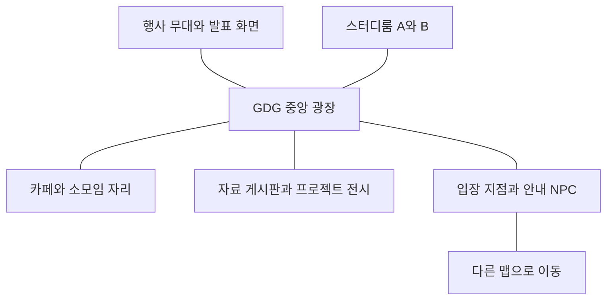

# 04. 화면·에셋·아바타·맵 에디터

## 1. 시각 방향

사용자 추가 방향에 따라 **Gather Classic의 플레이/통화 화면과 ZEP의 공간/맵 관리 흐름을 주 레퍼런스**로 삼는다. 공식 화면에서 확인한 요소와 HUFS Town에 적용할 상세 배치는 [07-reference-ux.md](07-reference-ux.md)를 따른다.

**“GDG HUFS의 작은 온라인 캠퍼스”**를 콘셉트로 한다. 픽셀 월드는 따뜻한 마을/동아리방 분위기로, 통화·설정·행사 UI는 한글을 읽기 쉬운 현대적인 웹 패널로 만든다. 실제 캠퍼스 일러스트는 도트 타일로 강제 변환하지 않고 로그인·공간 선택·행사 표지·월드 게시판의 포스터에 사용한다.

도트 화면에 들어가는 GDG 표식은 원본 비율과 색을 유지한 간판/배너로 배치한다. 제공 로고를 다시 그려 변형하는 대신 SVG 원본과 적정 크기 파생 이미지를 사용한다. 브랜드 사용 허용 범위와 추가 도트화 가능 여부는 배포 전 확인한다.

## 2. 실제 에셋 조사 결과

기준 경로: `C:/Project/hufstown/디자인에셋`.

| 실제 경로/분류 | 확인한 내용 | 사용 계획 |
|---|---|---|
| `GDG 에셋/GDG Assets` | 12파일. 가로·세로·밝음·어두움 로고, SVG·PNG·AI | 헤더·로그인·공간 카드·간판 |
| `GDG 에셋/Illustration/2025`, `2026` | 캠퍼스 PNG 6개 | 웰컴 화면·캠퍼스 선택·포스터 |
| `Pixel Art (6364)/RPG (1437)/Characters (1094)/Make-Your-Own Pieces (587)` | 조합 시트 PNG 587개, 모두 48×64 | 사용자 아바타 기본 시스템 |
| 위 폴더의 `Bodies` | 30개 | 체형·피부 변형 |
| `Clothing` | 195개, average/dainty/heavy 구분 | 의상 선택, 체형별 호환 |
| `Hair` | 264개, 체형별 구분 | 머리·색상 선택 |
| `Headgear`, `Other` | 각각 45개·53개 | 모자·추가 파츠, 실제 호환 검사 |
| `Pre-Made Characters (507)` | 48×64 시트 39개 + 16×16 PNG 468개 | NPC·프리셋; 같은 캐릭터 프레임을 별도 의상으로 세지 않음 |
| `RPG (1437)/Scenery (343)` | 타일시트 5개·스프라이트 330개·배경 8개 | 광장·정원·카페 외부·장식 |
| `RPG (1437)/Scenery (343)/Tile Sets (5)` | 256×256 시트 5종 | woodland 중심, beach/snow는 확장 테마 |
| `8bit Adventure (1489)/Tiles (713)/Indoors (324)` | 원본 시트와 숫자 이름 타일 | 실내 후보. RPG 색/크기와 맞는 것만 선별 |
| `UI (147)` | 색상별 버튼·체크박스·토글·9-slice | 월드 내부 간단 메뉴·상호작용 카드 |
| `Control Prompts (628)` | 밝음·어두움 키보드/게임 조작 표시 | 튜토리얼·키 바인딩 안내 |
| 퍼즐·인벤토리·몬스터 등 | 여러 스타일의 별도 게임 에셋 | R2 미니게임/수집 연출 후보 |

전체 파일 수는 6,391개이고 PNG는 6,381개다. 폴더명 괄호의 숫자와 실제 개수에 일부 차이가 있으므로 파일 메타데이터로 카탈로그를 생성한다. 배포에 쓸 핵심 세트만 추려야 하며 전체 폴더를 그대로 웹 번들에 넣지 않는다.

직접 확인한 대표 파일:

- `GDG 에셋/GDG Assets/gdgoc-horizontal.png`: 19,200×3,900. 웹 헤더에는 해당 SVG 또는 작은 파생본 사용.
- `GDG 에셋/Illustration/2026/illust_globalcampus_withgrass.png`: 2,181×1,599. 웰컴 일러스트 후보.
- `RPG (1437)/Scenery (343)/Tile Sets (5)/rpg_tileset_woodland_town.png`: 256×256. 나무·길·울타리·숲 마을 소재.
- `RPG (1437)/Characters (1094)/Pre-Made Characters (507)/angel_spritesheet.png`: 48×64. 프레임 시트 방식 확인용.
- `8bit Adventure (1489)/Tiles (713)/Indoors (324)/_indoor_tiles.png`: 실내 타일 스타일 확인용.

`RPG Character Maker`의 exe·ini·win 파일은 실행하거나 제품에 포함하지 않는다. 브라우저용 조합 로직을 이미지 manifest에서 만든다. 라이선스 파일은 이번 조사에서 발견하지 못했으므로 각 제공 출처·배포 권한·수정 허용·표기 조건을 asset manifest에 추가하는 작업이 필요하다.

## 3. 디자인 토큰 초안

제공 SVG에서 직접 읽은 색은 `#4285F4`, `#1E1E1E`, `#0CA94B`, `#FAA51A`, `#EE352F`, `#487DC0`다. 아래 UI 역할 배정은 디자인 제안이며 별도 공식 브랜드 가이드라고 주장하지 않는다.

| 토큰 | 값 | 용도 |
|---|---|---|
| brand.primary | #4285F4 | 주요 행동·선택·포커스 |
| brand.green | #0CA94B | 연결 성공·발화 표시 보조 |
| brand.yellow | #FAA51A | 대기·주의·손들기 보조 |
| brand.red | #EE352F | 나가기·송출 종료 |
| ink | #1E1E1E | 기본 본문 |
| surface | #FFFFFF | UI 패널 |
| surface.soft | #F6F8FC | 페이지 배경 제안 |
| border | #D8DFEA | 패널 경계 제안 |

본문은 시스템 한글 sans-serif를 기본으로 하며 웹폰트 추가 시 라이선스와 다운로드 비용을 검토한다. 픽셀 폰트는 짧은 월드 라벨에만 선택 적용한다. UI 기본 글자 14~16px, 주요 조작 버튼 44×44px 이상, 8px 간격 체계를 제안한다. 모든 조합의 대비를 실제 검사하고 브랜드 색 위 작은 흰 글자를 무조건 사용하지 않는다.

도트 소스는 16px 기반, 기본 표시 배율 3배(타일 48px)에서 시작한다. 정수 배율과 nearest-neighbor 렌더링을 우선하고, 장치 픽셀 비율·카메라 줌에서 흐림/떨림을 확인한다. 로고와 읽기용 웹 UI에는 픽셀 필터를 적용하지 않는다.

## 4. 화면 구성

| 화면 | 핵심 UI | 필수 상태 |
|---|---|---|
| 웰컴/로그인 | GDG HUFS 가로 로고, 캠퍼스 이미지, GDG HUFS SSO 로그인, 초대 코드 | 로그인 중·실패·초대 만료 |
| 홈/탐색 | 내 공간·최근 방문·즐겨찾기·공개 공간·새 공간 | 빈 목록·권한 없음·정원 가득 참 |
| 공간 생성 | 이름·템플릿·공개 범위·입장 방식·정원·표지 | 검증 오류·생성 중·중복 클릭 |
| 프로필/옷장 | 확대 아바타·파츠 탭·색·랜덤·저장 | 미보유/비호환 파츠·저장 실패 |
| 입장 준비 | 카메라 미리보기·마이크 레벨·장치·닉네임 | 권한 거부·장치 없음·대기실 |
| 월드 | 지도·통화 타일·공간명·채팅/사람·하단 제어 | 연결 중·자리비움·저사양·재접속 |
| 회의 집중 | 화면공유 중심·참가자·고정·회의실 잠금 | 공유 종료·발언 요청·노크 |
| 에디터 | 상단 도구·좌측 맵/레이어·중앙 캔버스·우측 속성/카탈로그·상단 게시 | 미저장·충돌·검증 실패·lease 만료 |
| 운영 콘솔 | 멤버·초대·신고·행사·로그·공간 설정 | 권한 변경·확인·처리 결과 |

월드의 데스크톱 와이어프레임:

```text
┌ GDG HUFS · 공간/맵        연결 상태    검색  미니맵  설정 ┐
│       현재 대화 대상 영상 1  2  3 ... / 발표 화면        │
│                                                        │
│                  도트 월드                              │
│            이름표 · 발화 · 이모지                        │
│                                       채팅/참가자 패널  │
│ [대화 범위: 주변 4명 / 스터디룸 A / 행사 전체]           │
└ 마이크  카메라  화면공유  감정표현  손들기  편집  나가기 ┘
```

노트북 화면에서는 지도에 최소한의 공간을 보장하고 패널은 한 번에 하나만 연다. 모바일은 화면 하단 시트와 가상 조이스틱/탭 이동을 사용한다. 모든 작은 아이콘에는 라벨·툴팁·키보드 포커스를 제공한다.

## 5. 첫 템플릿

### Campus Commons — GDG 기본 공간

64×48타일의 시작 맵. 남쪽 중앙에 스폰·안내 NPC·조작 안내, 가운데에 넓은 근거리 광장, 북쪽에 행사 무대·GDG 간판·발표 화면, 좌우에 카페 테이블/스터디 구역과 자료 게시판을 둔다. 별도 포털로 스터디룸·세미나홀로 이동한다.

근거리 모임 테이블 사이에는 반경을 고려한 간격을 두거나 각각 독립 구역으로 지정한다. 시각상 멀리 떨어졌어도 같은 zoneId를 재사용하면 통화가 연결되는 식의 혼동을 막기 위해 구역마다 독립 ID를 생성한다.



### Study Club

6~12인 독립 회의실 4개, 예약/이름 표지, 공용 휴게실, 자료 링크. 책상 등 현대형 실내 소품은 현 에셋을 시각 분류한 후 부족한 항목만 추가 제작한다. 폴더에 존재한다고 확인되지 않은 가구를 보유 에셋으로 단정하지 않는다.

### Meetup Hall

100명 행사 청중, 발표 구역, 손들기/Q&A, 부스·후원사 포스터, 네트워킹 구역. 청중 아바타와 좌석 표현은 100명을 수용하되 미디어는 발표 모드 정책을 사용한다.

## 6. 아바타 파이프라인

조합 순서는 기본 몸 → 의상 → 머리 → 모자 → 기타로 시작하되 실제 그림에 따라 뒤쪽 머리/장식 레이어를 나눈다. 각 파츠에 `bodyFamily`, `compatibleParts`, `frameLayout`, `anchor`, `layerOrder`를 명시한다.

```json
{
  "schemaVersion": 1,
  "bodyFamily": "average",
  "bodyId": "body.average.light",
  "clothingId": "clothes.average.casual01",
  "hairId": "hair.average.short.black",
  "headgearId": null,
  "accessoryId": null
}
```

위 ID는 계약 예시다. 실제 이름은 카탈로그 생성 때 대응시킨다. 랜덤 기능은 검증된 호환 조합만 뽑는다. 전신 tint로 피부·눈·옷이 모두 바뀌는 방식 대신 제공 색상 변형을 우선 사용한다.

서버에는 파츠 ID와 버전만 저장한다. 클라이언트는 조합 결과를 atlas/canvas texture로 캐시하고 원격 사용자에게 PNG를 매번 전송하지 않는다. 카탈로그 버전이 없는 파츠는 안전한 기본 프리셋으로 표시한다.

걷기 프레임을 확인한 후 달리기는 초기에는 재생 속도와 이동 속도를 조절한다. 앉기·박수·손 흔들기 전신 애니메이션이 없으면 초기에 오버레이 표현을 사용하고 필요한 신규 프레임을 작업 목록에 넣는다. 존재하지 않는 애니메이션을 완료로 표시하지 않는다.

## 7. 에셋 manifest

필수 항목: stable assetId, 원본 상대 경로, 파일 hash, 크기, 타일 크기, 프레임 목록/시간, anchor, collision footprint, 렌더 레이어, 태그, 호환 테마, 허용 방향, 출처/라이선스 상태, atlas key, 썸네일, 로딩 그룹.

발 위치를 기준 anchor로 통일하고 오브젝트는 바닥 장식/높이 있는 물체/전경을 구분한다. Y-sort 기준은 하단 기준점이다. 큰 나무의 그림 전체를 충돌 영역으로 쓰지 않고 줄기 부분만 footprint로 지정한다.

자유 배치를 지원하되 모든 에셋을 자유 회전시키지 않는다. 정면 시점 스프라이트를 90도 돌려 눕히는 대신 방향 variant가 있는 에셋만 방향 변경을 제공한다. 장식 포스터는 별도 회전/크기 기능을 허용할 수 있다. 충돌·구역 타일은 그리드에 정렬한다.

## 8. 맵 포맷

```json
{
  "schemaVersion": 1,
  "mapId": "map-campus",
  "revision": 1,
  "size": { "width": 64, "height": 48 },
  "sourceTileSize": 16,
  "assetManifestVersion": "initial",
  "layers": [
    { "id": "ground", "kind": "tile", "chunkSize": 16 },
    { "id": "decor", "kind": "object" },
    { "id": "foreground", "kind": "object" }
  ],
  "collisionChunks": [],
  "objects": [],
  "zones": [
    { "id": "study-a", "type": "private", "rect": [8, 8, 10, 8], "capacity": 12 }
  ],
  "spawns": [{ "id": "entry", "x": 32, "y": 42 }],
  "portals": []
}
```

좌표는 타일 단위, rect는 `[x, y, width, height]`다. 실제 tile/object payload와 압축 방식은 공용 contracts의 맵 스키마에서 정하고 Java/TypeScript 로더에 같은 fixture를 적용한다. 그림 레이어와 서버 충돌/음향/구역 데이터는 같은 게시 revision에서 생성된다. Tiled JSON 가져오기는 지원 가능한 속성만 변환하며 임의 파일이 곧 내부 형식은 아니다.

공용 좌표 규칙은 맵 단위 1을 논리 타일 하나로 정의한다. 충돌 후보 색인은 1타일 셀, 편집기 배치와 바닥 브러시/채우기는 0.5타일 셀, 클릭 경로 탐색은 0.25타일 셀을 사용한다. 아바타 위치는 분수 타일을 허용하는 연속 좌표로 이동해 격자 경로를 자연스럽게 따라간다. 현재 schemaVersion 2의 충돌·바닥 데이터는 사각형으로 보관하고 런타임에서 격자 인덱스를 파생하므로 기존 게시 맵을 변환할 필요가 없다. 변경 가능한 좌표 규칙은 프런트 `src/mapGrid.ts` 한 곳에 둔다.

포털 도착 지점·스폰·구역에는 안정적인 ID를 사용한다. 구역 이름을 바꿔도 통화 ID는 유지되고, 구역 복제 시 새 ID를 생성한다. 겹치는 비공개 구역과 모순되는 미디어 효과는 게시 검증에서 거부한다.

## 9. 에디터 UX와 저장

도구: 선택/이동, 타일 브러시, 채우기, 지우개, 오브젝트 배치, 충돌 표시, 스폰, 포털, 구역, 텍스트/링크 오브젝트. 단축키: 실행 취소·재실행·복사·붙여넣기·다중 선택·그리드 표시. 삭제는 참조 검사와 undo를 제공한다.

편집 모델은 명령 기반 operation log와 초안 스냅샷이다. 각 명령에 operationId, baseDraftVersion, actor, 변경 대상을 붙인다. 같은 명령 재전송은 중복 적용하지 않는다. 저장 충돌을 조용히 덮어쓰지 않고 최신 버전 재로드/복구 초안으로 안내한다.

**R1은 지도당 작성자 1명 lease + 다른 편집자 읽기 모드.** 자동 저장·타임아웃·명시적 인계·fencingToken으로 떠난 탭의 뒤늦은 쓰기를 막는다. lease 갱신 실패 시 편집을 읽기 전용으로 전환하고 로컬 복구 초안을 제공한다. R2 공동 편집에서는 Yjs 등을 평가하되 게임 규칙 검증과 게시 권한은 여전히 서버가 소유한다.

멤버의 자유 배치는 공간 설정에 따라 에디터 권한 또는 지정 구역의 제한된 꾸미기 권한으로 제공한다. 모든 참가자가 다른 사람의 구조물을 지울 수 있게 열어두지 않는다.

## 10. 게시와 롤백

1. JSON 스키마·에셋 참조·용량·맵 경계·타일 효과를 검사한다.
2. 안전 스폰, 출구 접근성, 포털 대상, 잠긴 구역과 중첩 구역을 검사한다.
3. 오브젝트 수·텍스처 예산·금지된 외부 링크/미승인 파일을 검사한다.
4. 불변 맵 파일과 참조 목록을 만든 뒤 DB에서 게시 포인터를 트랜잭션으로 변경한다.
5. outbox 이벤트로 월드 서버에 새 revision을 알린다. 파일 준비가 끝나기 전에 게시 포인터를 바꾸지 않는다.
6. 장식만 바뀌면 diff 적용이 가능하다. 충돌·구역·포털 변경이면 통화 경계를 회수하고 사용자 위치를 재검증한 뒤 revision 전환을 완료한다.
7. 새 벽 안에 갇힌 사용자는 가장 가까운 유효 위치 또는 스폰으로 이동시키고 안내한다.
8. 실패 시 기존 revision으로 돌아간다. 롤백도 새 게시 이력을 남기며 과거의 원본 파일을 수정하지 않는다.

서비스 중 맵 수정은 동작 중인 월드 상태와 초안을 직접 연결하지 않는다. 꾸미기 미리보기와 실제 사용자 적용 시점을 분리해야 운영 중 편집이 안전하다.

## 11. 디자인 완료 조건

대표 화면을 1440×900·1280×720·390×844 크기로 확인한다. 도트 깨짐/필터링, 한글 줄바꿈, 100명 이름표 겹침, 텍스트/장치 오류, 키보드 포커스, 채팅 중 이동 방지, 저장 실패, 정원 만료 상태를 확인한다. 기본 테마에는 아바타와 장식이 배경에서 구분될 만큼 대비를 확보한다.
